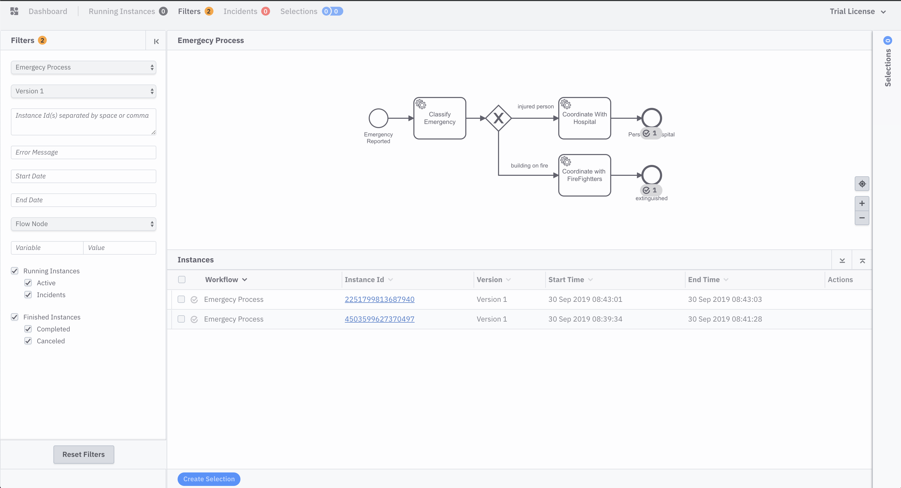

# Zeebe on k8s with HELM Getting Started Guide
This repository contains some files for the Zeebe on Kubernetes Getting Started Guide. 


# Pre Requisites
- Git / Java / Maven
- Kubernetes Cluster + `kubectl`
  - Local: [Kubernetes KIND](https://github.com/kubernetes-sigs/kind), Minikube, MicroK8s
  - Remote: GKE, Azure, EKS
- HELM cli 
- (Optional) Zeebe Modeler
- (Optional) Zeebe CTL
- (Optional) Spring Boot Zeebe Worker

You can run this guide against any Kubernetes Cluster. 

You can also find a Spring Boot Worker which implements the `classify`, `hospital` and `firefighters` workers for the `BPMN Service Tasks` included in the example process here [Zeebe Spring Boot Example Worker](https://github.com/salaboy/zeebe-worker-spring-boot-example)


In order to run a simple demo based on the `emergency-process.bpmn` file provided in this repository you can run the following commands:

### Install HELM in your cluster (if you don't have it already)
> kubectl apply -f helm-service-account-role.yaml
> helm init --service-account helm --upgrade 

### Add Zeebe HELM Repository
> helm repo add zeebe https://helm.zeebe.io
> helm repo update

### Install Zeebe Full HELM Chart (Zeebe Cluster + Operate + Ingress Controller)
> helm install --name <RELEASE NAME> zeebe/zeebe-full

NOTE: change <RELEASE NAME> with a name of your choice

If you are using Kubernetes KIND]() add `-f kind-values.yaml`
> helm install --name <RELEASE NAME> zeebe/zeebe-full -f kind-values.yaml

### Zeebe Modeler
If you are in Mac OSX you can install it with homebrew:
> brew cask install zeebe-modeler

Or download from here: [Zeebe Modeler Releases](https://github.com/zeebe-io/zeebe-modeler/releases)

You can open and modify the `emergency-process.bpmn` file with it now. 

### Check that Pods are up and running: 
> kubectl get pods

Should return something like: 
```
NAME                                                   READY   STATUS    RESTARTS   AGE
elasticsearch-master-0                                 1/1     Running   0          10m
elasticsearch-master-1                                 1/1     Running   0          10m
elasticsearch-master-2                                 1/1     Running   0          10m
<RELEASE NAME>-nginx-ingress-controller-5cf6dd7894-s9xkr      1/1     Running   0          10m
<RELEASE NAME>-nginx-ingress-default-backend-f5454db5-8jgpq   1/1     Running   0          10m
<RELEASE NAME>-operate-5d4867d6d-qxqq5                        1/1     Running   2          10m
<RELEASE NAME>-zeebe-0                                        1/1     Running   0          10m
<RELEASE NAME>-zeebe-1                                        1/1     Running   0          10m
<RELEASE NAME>-zeebe-2                                        1/1     Running   0          10m
```

### Interact with the services inside the Cluster
In order to interact with the services inside the cluster you need to use `port-forward` to route traffic from your environment to the cluster. 
> kubectl port-forward svc/<RELEASE NAME>-zeebe 26500:26500

Now you can connect and execute operations against your newly created Zeebe cluster. 
Notice that you need to keep running the `port-forward` command to be able to communicate with the remote cluster.

### Zeebe CLI - Command Line Interface (zbctl)
You can get the `zbctl` tool from the official [Zeebe Release Page](https://github.com/zeebe-io/zeebe/releases) 

`zbctl` by default is configured to point to `localhost:26500` to interact with a cluster, and because we are running `port-forward` from our environment to the cluster, our `26500` port is redirected to the cluster service. 

Download and add `zbctl` to your path, and now you can check the connection with your cluster:
> zbctl status --insecure

This should return something like this: 
```
Cluster size: 3
Partitions count: 3
Replication factor: 3
Brokers:
  Broker 0 - salaboy-zeebe-0.salaboy-zeebe.default.svc.cluster.local:26501
    Partition 1 : Follower
    Partition 2 : Leader
    Partition 3 : Follower
  Broker 1 - salaboy-zeebe-1.salaboy-zeebe.default.svc.cluster.local:26501
    Partition 1 : Leader
    Partition 2 : Follower
    Partition 3 : Leader
  Broker 2 - salaboy-zeebe-2.salaboy-zeebe.default.svc.cluster.local:26501
    Partition 1 : Follower
    Partition 2 : Follower
    Partition 3 : Follower
```

Once you have your connection to your cluster you can deploy our process defintion by running: 
> zbctl deploy emergency-process.bpmn --insecure

Next step is to create Workflow Instances. Notice that you can send variables: 
> zbctl create instance EMERGENCY_PROCESS --variables "{\"emergencyReason\" : \"person\"}" --insecure

or/and

> zbctl create instance EMERGENCY_PROCESS --variables "{\"emergencyReason\" : \"building on fire\"}" --insecure

### Accessing Operate from outside the cluster
The `Zeebe Full HELM Charts` install an Ingress Controller. If this is deployed in a cloud provider, it should provision a LoadBalancer which will expose an External IP that can be used as the main entry point to access all the services/applications that are configured to have Ingress Routes. 

You can find the External IP by running: 
> kubectl get svc

You should see something like: 
```
NAME                                    TYPE           CLUSTER-IP       EXTERNAL-IP   PORT(S)                                  AGE
<RELEASE NAME>-nginx-ingress-controller        LoadBalancer   10.109.108.4     <pending>     80:30497/TCP,443:32232/TCP               63m
```

Where the `<pending>` under the `EXTERNAL-IP` column should change to a public IP that you (and other users) should be able to access from outside the Cluster. You might need to check your Cloud Provider specific configuration if that doesn't work. 

If you are running in Kubernetes KIND, you will need to `port-forward` to the Ingress Controller main entry point due KIND doesn't support LoadBalancers. You can do that by running in a different terminal:

> kubectl port-forward svc/<RELEASE NAME>-nginx-ingress-controller 8080:80

Then you should be able to access Operate at [http://localhost:8080](http://localhost:8080/)

Using `demo`/`demo` for credentials. 

At this point, if you create two process instances you will see that they are both stuck at the `Classify Emergency` task. This is because you don't have workers for such tasks, so the process will wait in that state until we provide one of these workers. 

### Starting a simple Spring Boot Zeebe Worker

Clone and run the Simple Zeebe Spring Boot Worker:
> git clone https://github.com/salaboy/zeebe-worker-spring-boot-example
> cd  zeebe-worker-spring-boot-example/
> mvn spring-boot:run

Once again, the worker is configured by default to connect to `localhost:26500` to fetch Jobs. If everything is up and running the worker will start and connect, automatically completing the pending tasks in our Workflow Instances. 
If you refresh Operate (http://localhost:8080) you will find both Instances completed:


